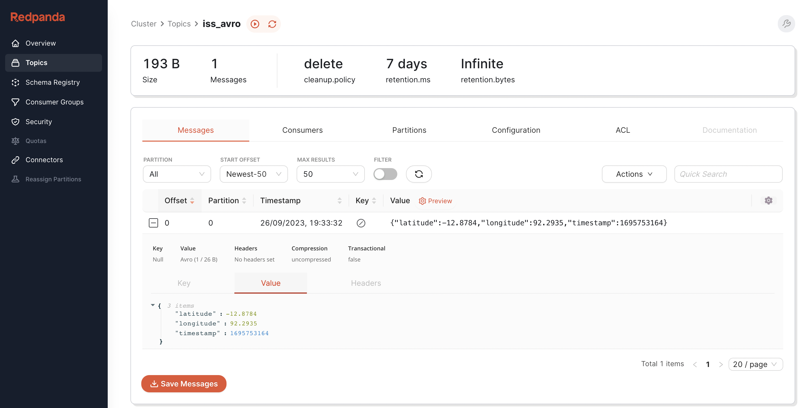

# Redpanda International Space Station Demo

This demo queries live tracking data from the International Space Station and converts it from JSON to Avro using a WebAssembly Transformation.

## Overview


This example uses cUrl to query data from api.open-notify.org which is then piped through to `rpk topic produce`.

Once in Redpanda we use WebAssembly to transform the data from JSON to Avro, on the `iss_avro` topic and from there we can view the data using Redpanda Console.

## Files in the demo
- [docker-compose.yml](docker-compose.yml) - Used to setup the sandbox and Redpanda Console - note: you may need to update the label in this file to get the latest version of the sandbox.
- [iss.avsc](iss.avsc) - Avro schema used for conversion.
- [profile.yml](profile.yml) - Used with the `rpk profile` command
- [transform.go](transform.go) - This is the Golang code that will be compiled to WebAssembly. This code:
    
    - Initializes the transform, including getting the schema from the schema registry and creating the `goavro` codec object (both stored in global variables)
    - Registers the callback `toAvro`
    - `toAvro` parses the JSON into a struct `iss_now`, converts the struct into a map and then converts the map to Avro binary using the `goavro` codec.
    - We also prepend the schema id using the magic five bytes `0x0` followed by a BigEndian `uint32`.
    - This is all appended to the output slice.

## Running the demo

> Before you start, make sure that you have `golang` version 1.20 or above installed on your system.

1. Download and extract the sandbox version of `rpk` using the instructions for your platform from the [Redpada documentation](https://docs.redpanda.com/current/get-started/rpk-install/).
2. Start the containers using 
```
# docker-compose up -d
```
This should output as follows:
```
Creating network "iss_demo_default" with the default driver
Creating iss_demo_redpanda_1 ... done
Creating redpanda-console    ... done
```
3. Post the Avro schema to the schema registry using a cURL command:
```
# jq '. | {schema: tojson}' iss.avsc | curl -X POST "http://localhost:8081/subjects/iss_position/versions" -H "Content-Type: application/vnd.schemaregistry.v1+json" \
        -d @-    
```
Take a note of the schema id that is returned from this command (on a clean environment this will be `1` bit check the output from this command):
```
{"id":1}
```
4. Setup your rpk profile:
```
# rpk profile create iss_demo --from-profile profile.yml
```
5. Create the topics needed `iss_json` and `iss_avro`:
```
# rpk topic create iss_json iss_avro
TOPIC     STATUS
iss_json  OK
iss_avro  OK
```
6. Build the transform:
```
# rpk transform build
build successful
deploy your transform to a topic:
	rpk transform deploy
```
> Note: This may fail if `golang` is not correctly installed and configured on your system.
7. Deploy the transform - this command will need the schema id from above and the names of the topics:
```
# rpk transform deploy --var=SCHEMA_ID=1 --input-topic=iss_json --output-topic=iss_avro

Deploy successful!
```

We are now at a position where we can test that the data can be converted from JSON to Avro.

1. Get a single record representing the location of the ISS:
```
# curl http://api.open-notify.org/iss-now.json

{"message": "success", "timestamp": 1695753164, "iss_position": {"latitude": "-12.8784", "longitude": "92.2935"}}
```
2. We can then paste this record into `rpk topic produce` as follows:
```
# rpk topic produce iss_json

{"message": "success", "timestamp": 1695753164, "iss_position": {"latitude": "-12.8784", "longitude": "92.2935"}}
Produced to partition 0 at offset 0 with timestamp 1695753212929.

^C
```
3. We'll now consume the Avro topic using `rpk topic consume` and observe that it has been converted to Avro:
```
# rpk topic consume iss_avro

{
  "topic": "iss_avro",
  "value": "\u0000\u0000\u0000\u0000\u0001\ufffd\ufffd\u0011\ufffd\ufffd\ufffd)\ufffd\u0010X9\ufffd\ufffd\u0012W@\ufffd\ufffd\ufffd\ufffd\u000c",
  "timestamp": 1695753212929,
  "partition": 0,
  "offset": 0
}
```
4. We can also navigate our browser to [Redpanda Console](http://localhost:8080/topics/iss_avro?p=-1&s=50&o=-1#messages) to view the decoded data:

5. We can now setup a loop to poll the location of the ISS:
```
# while true
do
line=`curl http://api.open-notify.org/iss-now.json -s`
echo $line | rpk topic produce iss_json
sleep 1
done   
```